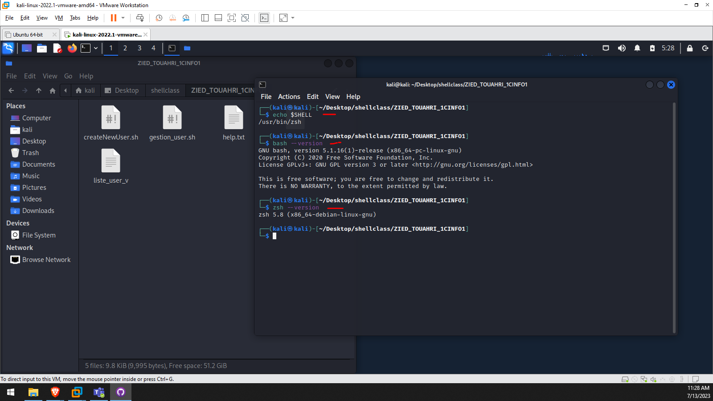

# shellclass

## How to Use the Project

To create users for test:
```diff
+  sudo ./createNewUser.sh
```


For managing users:
```diff
+  sudo ./gestion_user.sh [-h|--help] [-g] [-v] [-m]
```


On peut verrouiller un compte utilisateur de plusieurs manières. En préfixant le mot de passe dans `/etc/passwd` par un "!" (ou en remplaçant "x" par "*"). Voici comment verrouiller et déverrouiller un compte utilisateur :
```diff
-  Pour verrouiller : `passwd -l` ou `usermod -L`
```

```diff
+  Pour déverrouiller : `passwd -u` ou `usermod -U`
```

To test if a user is locked or not, use the command:
```diff
+  sudo grep ziedth3 /etc/shadow
```


Example of the result:<br>
ziedth3:!$y$j9T$aaRRyCXDKlGSgQdOg0Ygy1$on67ikXvfqfxsY9ks.22SCG0CIwkule8oIRdokJJde8:0:0:99999:7:::

If there is an "!" after the first ":", the user is locked. If there is no "!", the user is unlocked. :)

Il suffit de modifier, grâce à n'importe quel éditeur de texte, le fichier `/etc/passwd`, qui contient une ligne par utilisateur et plusieurs champs par ligne, séparés par ":". Un des champs contient le répertoire par défaut.

Pour tester, tapez :
```diff
+  sudo grep ziedth3 /etc/passwd
```

<h4>Bash and shell I use:</h4>
<br>

